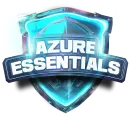

# 🎓 Microsoft Azure Essentials - DIO 

## 📁 Repositório AZ-900

Bem-vindo ao repositório do **Bootcamp Microsoft Azure Essentials** da DIO! Aqui você encontrará alguns dos recursos e links que vou utilizar para concluir o bootcamp.

## 🗂️ O Que Você Encontrará Aqui

Este repositório está organizado para ajudar a armazenar e gerenciar todos os materiais do bootcamp.

- **📚 Recursos de Estudo**: Links e materiais recomendados para o estudo do AZ-900.
- **💻 Projetos e Desafios**: Códigos e exercícios práticos realizados durante o bootcamp.
- **🔗 Link Útil**: Link para a documentação oficial (Material de grande importância para o exame AZ-900)

## 🔍 Recursos de Estudo

Aqui você encontrará uma lista de recursos úteis para se preparar para o exame AZ-900:

- [Link para o material oficial do Azure](https://docs.microsoft.com/azure/)
- [Curso completo de Azure](https://www.youtube.com/watch?v=5abffC-K40c)
- [Guia de Estudos](https://learn.microsoft.com/pt-br/credentials/certifications/azure-fundamentals/?practice-assessment-type=certification)

## 💻 Projetos e Desafios

Veja os projetos e desafios que completei durante o bootcamp:

- **Desafio 1**: [Criação de VM em Azure](https://github.com/GuylhermeI/desafio-azure-dio/blob/main/Desafio%2301%20-%20Cria%C3%A7%C3%A3o-de-VM-em-Azure.md)